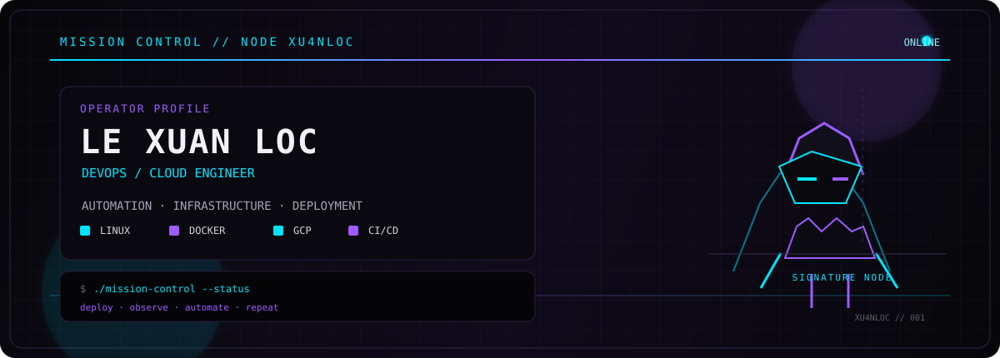

<div align="center">



# `XU4NLOC // MISSION CONTROL`

### DEVOPS / CLOUD ENGINEER · BACKEND-LEANING SOFTWARE ENGINEER

> **SYSTEM STATUS:** `ONLINE`  
> **CURRENT OBJECTIVE:** `AUTOMATE · DEPLOY · OBSERVE · IMPROVE`

[](https://www.linkedin.com/in/le-xuanloc)
[](mailto:lexuanloc0501.work@gmail.com)
[](https://github.com/XU4NLOC)

</div>

---

## `01 // MISSION PROFILE`

```text
OPERATOR    : Le Xuan Loc
CALLSIGN    : XU4NLOC
CLASS       : DevOps / Cloud Engineer
BACKGROUND  : Software Engineering + Cloud Technologies
SPECIALTY   : Automation / Infrastructure / Deployment
BASE        : Ho Chi Minh City, Vietnam
```

I'm a recent Information Technology graduate focused on **DevOps and cloud engineering**, with a software-engineering foundation in backend systems.

My work sits where **code meets infrastructure**: containerizing services, automating delivery pipelines, deploying Linux-based environments, and keeping services observable and repeatable.

I enjoy building systems that reduce manual work and make deployment less fragile.

### `MISSION OBJECTIVES`

- **Automate** repetitive engineering and delivery workflows.
- **Deploy** containerized services across Linux and cloud environments.
- **Operate** services with practical health checks, service management, and reproducible environments.
- **Build** backend systems when the infrastructure needs a deeper software-engineering layer.

---

## `02 // TECHNICAL ARSENAL`

### `INFRASTRUCTURE`


### `CI/CD + AUTOMATION`


### `CLOUD`


### `SOFTWARE LAYER`


---

## `03 // ACTIVE / COMPLETED OPERATIONS`

### `[ OP-01 ] AUTOMATED CODE DELIVERY`

**DISION TECH LLC · FULL-STACK ENGINEER · JUL 2026 — SEP 2026**

Built a Bash automation pipeline connecting **Gitea** with an AI coding agent for issue triage, branch creation, and pull-request generation, while keeping **human review as the final merge gate**.

**CONTROL LAYER**

`Automated labeling` → `Git validation` → `Build verification` → `Failure handling` → `Human review`

**INFRASTRUCTURE**

`Ubuntu` · `Incus` · `systemd` · `Nginx` · `Health checks` · `Scheduled snapshots`

---

### `[ OP-02 ] CLOUD MICROSERVICE DEPLOYMENT`

**RMIT UNIVERSITY VIETNAM × NEXTWAY TECHNOLOGY · BACKEND ENGINEER (DEVOPS)**

Supported deployment of a **seven-service microservices application** on **GCP Cloud Run**, with REST-based service communication.

Built automated build/deployment workflows with **GitHub Actions** and **Google Cloud Build**, while using Docker to standardize local and cloud environments.

`7 services` · `Cloud Run` · `Docker` · `GitHub Actions` · `Cloud Build`

---

### `[ OP-03 ] REPEATABLE CONTAINERIZED DELIVERY`

**CHEMIZOL · SOFTWARE ENGINEER · DEC 2025 — APR 2026**

Built and containerized a responsive React catalog covering **200+ chemical products**, maintaining a repeatable deployment workflow for stakeholder testing and review.

`React` · `Docker` · `Deployment workflow`

---

## `04 // SELECTED MISSIONS`

<table>
<tr>
<td width="50%" valign="top">

### `MISSION // CHAT-SERVER`

**Real-time backend infrastructure**

`Go` · `PostgreSQL` · `WebSocket` · `JWT` · `Docker`

Concurrent Hub architecture using goroutines/channels with dedicated read/write goroutines per connection.

Authentication is performed before the WebSocket handshake, with bcrypt password hashing and PostgreSQL-backed message-history replay.

**[ ACCESS REPOSITORY → ](https://github.com/XU4NLOC/chat-server)**

</td>
<td width="50%" valign="top">

### `MISSION // PORTSCANNER`

**Concurrent network tooling**

`Go` · `goroutines` · `sync.WaitGroup`

Worker-pool based TCP port scanner with configurable host, port range, worker count, and timeout.

Reduced a 1,024-port scan from **~100s to under 2s** versus sequential scanning.

**[ ACCESS REPOSITORY → ](https://github.com/XU4NLOC/portscanner)**

</td>
</tr>
</table>

---

## `05 // OPERATING MODEL`

```text
                   ┌─────────────────────────┐
                   │       SOURCE CODE       │
                   └────────────┬────────────┘
                                │
                                ▼
                   ┌─────────────────────────┐
                   │       VALIDATION         │
                   │ Git / Build / Checks     │
                   └────────────┬────────────┘
                                │
                                ▼
                   ┌─────────────────────────┐
                   │       CONTAINERIZE       │
                   │        Docker            │
                   └────────────┬────────────┘
                                │
                                ▼
            ┌───────────────────┴───────────────────┐
            │                                       │
            ▼                                       ▼
   ┌─────────────────┐                    ┌─────────────────┐
   │    LINUX HOST   │                    │       GCP       │
   │ Ubuntu / Incus  │                    │    Cloud Run    │
   │ systemd / Nginx│                    │  Build / Storage │
   └────────┬────────┘                    └────────┬────────┘
            │                                      │
            └──────────────────┬───────────────────┘
                               ▼
                   ┌─────────────────────────┐
                   │   HEALTH / OPERATIONS   │
                   │ checks · snapshots      │
                   │ repeatable environments │
                   └─────────────────────────┘
```

---

## `06 // EXPERIENCE LOG`

<details>
<summary><b>DISION TECH LLC</b> · Full-Stack Engineer · Jul 2026 — Sep 2026</summary>

- Built Bash automation linking Gitea with an AI coding agent for issue triage, branch creation, and pull-request generation.
- Added automated labeling, Git validation, build verification, and failure handling before merge.
- Deployed the website, automation service, and preview environments on Ubuntu with Incus.
- Provisioned isolated containers, networks, resource limits, and systemd-managed services.
- Configured Nginx, health checks, scheduled snapshots, and preview synchronization.
- Authored deployment and service-health test cases and documentation.

</details>

<details>
<summary><b>CHEMIZOL</b> · Software Engineer · Dec 2025 — Apr 2026</summary>

- Built a searchable React catalog covering 200+ chemical products.
- Containerized the application with Docker.
- Maintained a repeatable deployment workflow for stakeholder testing and review.

</details>

<details>
<summary><b>AURION TECHNOLOGY</b> · Software Engineer · Nov 2025 — Jan 2026</summary>

- Implemented Python application workflow states for donor-patient matching logic.
- Integrated streaming AI responses into backend APIs.
- Investigated and resolved pre-production stability issues.

</details>

<details>
<summary><b>RMIT UNIVERSITY VIETNAM × NEXTWAY TECHNOLOGY</b> · Backend Engineer (DevOps) · Mar 2025 — Sep 2025</summary>

- Supported deployment of a seven-service microservices application on GCP Cloud Run.
- Automated build and deployment workflows with GitHub Actions and Google Cloud Build.
- Containerized services with Docker to standardize local/cloud environments.
- Integrated Firebase and Google Cloud Storage.

</details>

---

## `07 // TELEMETRY`

```text
[ GITHUB ACTIVITY ]
████████████████████████████████████████████████

[ CURRENT FOCUS ]
DevOps        ████████████████████  deployment / automation
Cloud         █████████████████    GCP / Cloud Run
Containers    ███████████████████  Docker / Incus
Backend       ███████████████      Go / APIs / WebSockets
Systems       █████████████████    Linux / Bash / services
```

My strongest current direction is **DevOps / Cloud**, with backend engineering as the software layer that supports it.

---

## `08 // COMMS`

```text
LINKEDIN : linkedin.com/in/le-xuanloc
EMAIL    : lexuanloc0501.work@gmail.com
GITHUB   : github.com/XU4NLOC

MESSAGE CHANNEL : OPEN
```

[](https://www.linkedin.com/in/le-xuanloc)
[](mailto:lexuanloc0501.work@gmail.com)

---

<div align="center">

```text
┌─────────────────────────────────────────────────────────────┐
│ XU4NLOC // MISSION CONTROL                                  │
│                                                             │
│ build systems that deploy themselves                        │
│ keep infrastructure observable                              │
│ and turn repetitive work into automation                    │
│                                                             │
│ STATUS: ONLINE // END OF TRANSMISSION                       │
└─────────────────────────────────────────────────────────────┘
```

</div>
